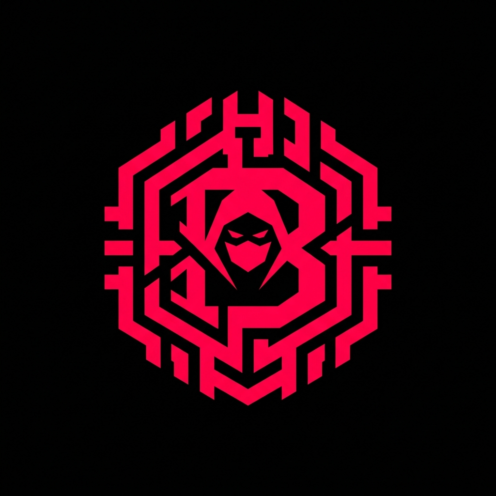
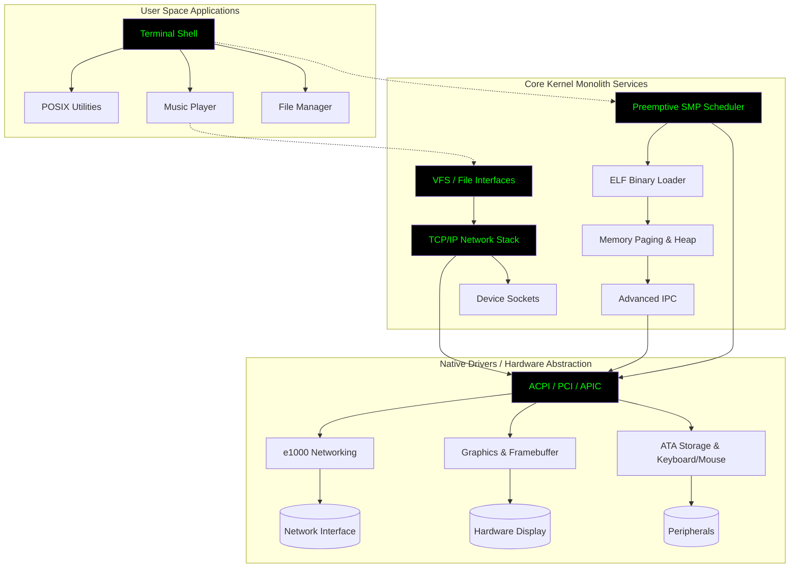

<div align="center">

<!-- Animated Header -->


# BlackOS PHANTOM

<p align="center">
  <strong>Enterprise-Grade, Bare-Metal 32-bit Operating System Built From Scratch</strong>
</p>

<!-- Animated Badges -->
<p align="center">
  <a href="#"></a>
  <a href="#"></a>
  <a href="#"></a>
  <a href="#"></a>
  <a href="#"></a>
</p>

<p align="center">
  <a href="#"></a>
  <a href="#"></a>
  <a href="#"></a>
  <a href="#"></a>
</p>

<!-- Typing Animation SVG -->
<p align="center">
  
</p>

<br/>

<!-- Wave Animation -->


</div>

<br/>

## Overview

<table>
<tr>
<td width="50%">

**BlackOS PHANTOM** is a high-performance, monolithic operating system engineered closely to the metal. Designed to be completely independent, it implements its own standard C library (`libc`), device drivers, security isolation rings, networking suite, and a custom interactive graphical environment.

**Key Technical Achievements:**
- Symmetric Multiprocessing (SMP) Support
- Comprehensive TCP/IP Network Stack
- Preemptive Multitasking & Context Switching
- Custom 32-bit ELF Loader
- Multi-Layered Virtual File Systems (VFS, DEVFS, PROCFS)
- ACPI, APIC, and IOAPIC Hardware Scanning
- Security Isolations, Capabilities, and Seccomp
- Advanced Concurrency Primitives

</td>
<td width="50%">

```ascii
  ██████╗ ██╗      █████╗  ██████╗██╗  ██╗ ██████╗ ███████╗
  ██╔══██╗██║     ██╔══██╗██╔════╝██║ ██╔╝██╔═══██╗██╔════╝
  ██████╔╝██║     ███████║██║     █████╔╝ ██║   ██║███████╗
  ██╔══██╗██║     ██╔══██║██║     ██╔═██╗ ██║   ██║╚════██║
  ██████╔╝███████╗██║  ██║╚██████╗██║  ██╗╚██████╔╝███████║
  ╚═════╝ ╚══════╝╚═╝  ╚═╝ ╚═════╝╚═╝  ╚═╝ ╚═════╝ ╚══════╝
```

</td>
</tr>
</table>

<br/>

<div align="center">

</div>

<br/>

## Table of Contents

- [Live Preview Workspace](#live-preview-workspace)
- [System Architecture](#system-architecture)
- [Deep Dive: Operating System Components](#deep-dive-operating-system-components)
- [Networking Structure](#networking-structure)
- [Graphic Interface (GUI) Engine](#graphic-interface-gui-engine)
- [Security & Process Management](#security--process-management)
- [Build Requirements](#build-requirements)
- [Quick Start Configuration](#quick-start-configuration)
- [License](#license)

<br/>

## Live Preview Workspace

Experience the true capability of **BlackOS PHANTOM**. Below is raw footage of the system booting, interacting with the graphical interface, dynamically rendering overlapping windows, traversing directories, and executing local tasks entirely unassisted by an underlying host operating system.

<div align="center">
  <video src="https://github.com/BLACK0X80/BLACK-OS/raw/main/demo%20video/black%20os.mp4" width="850" controls></video>
  <br/>
  <em>If the player above does not load inline, <a href="https://github.com/BLACK0X80/BLACK-OS/raw/main/demo%20video/black%20os.mp4">click here to watch the demo directly</a>.</em>
</div>

<br/>

## System Architecture



<br/>

## Deep Dive: Operating System Components

BlackOS provides a comprehensive stack designed utilizing modern OS design patterns translated directly to bare-metal interactions.

### Symphony of Synchronization
True Symmetric Multiprocessing (SMP) creates complex concurrency edge cases. BlackOS mitigates this with a robust internal synchronization API:
- `Mutexes` & `Spinlocks`
- `Semaphores` & `Condition Variables`
- `Read-Write Locks` (RWLock)
- Cross-CPU `Waitqueues` 

### File Systems Architecture
The file system separates physical storage semantics from the kernel logic using a highly modular VFS (Virtual File System) model. Mounted components include:
- **RamFS**: In-memory ephemeral storage that is spun up dynamically at boot.
- **DevFS**: Virtual interface mapping to hardware drivers (e.g. `/dev/sda`).
- **ProcFS**: Exposes deep kernel execution data, providing real-time views into running threads and SMP allocations.
- **FAT32 Integration**: Foundational read/write blocks for standard DOS/Windows formatted disk compatibility.

<br/>

## Networking Structure

Built directly into the core, the network layer handles a complete TCP/IP stack implementation.
- **Physical Integration**: Direct support for standard Intel `e1000` Network Interface Controllers.
- **Ethernet / Link Layer**: In-house packet framing, ARP resolution, and loopback mechanisms.
- **Network Layer**: IP parsing and standard ICMP (Ping) processing.
- **Transport Layer**: Implements full stream controls for TCP endpoints and UDP datagram sockets.
- **Application Services**: HTTP handling and fundamental DHCP handshakes for autonomous IP allocation.

<br/>

## Graphic Interface (GUI) Engine

Operating independently of standard X11 or external display engines, BlackOS maintains a bespoke graphical window compositor.
- **Framebuffer Driver**: High-color depth mapping replacing legacy text-mode memory buffers.
- **Z-Index Rendering Engine**: Mathematically calculates depths of overlapping frames ensuring perfect visual layering and drop shadows around active contexts.
- **Event Loops**: Efficient signal tracking for mouse coordinates, clicks, and keyboard strokes bridging directly from IRQs into graphical input arrays.
- **Dynamic Assets**: Built-in support for desktop backgrounds, cursors, and visual matrix animations rendered actively via hardware interrupts.

<br/>

## Security & Process Management

- **ELF32 Native Processing**: Loads dynamically linked standard ELF formatted `.elf` binaries into distinct execution profiles directly inside user space memory constraints.
- **Advanced Ring Protections**: Employs process isolation keeping crashing user-land applications (`Ring 3`) from throwing segmentation faults into the core kernel (`Ring 0`).
- **Capabilities & POSIX Emulation**: Mirrors standard Linux/Unix capabilities assigning root vs guest-level rights through the `security.c` and `seccomp.c` modules.
- **Rich POSIX Applications**: Comes populated with classic Unix tooling locally compiled (`ls`, `uptime`, `cat`, `ps`, `wc`, `yes`, `echo`).
- **Inter-Process Communication (IPC)**: Reliable signal handlers allowing disconnected applications to exchange buffer blocks asynchronously.

<br/>

## Build Requirements

The OS is configured to be cross-compiled utilizing a standard `i686-elf-` GNU toolchain. It can be built natively on Linux, macOS, or within a Windows `MinGW UCRT64` / `MSYS2` environment.

- `gcc` (13.2.0+ cross-compiled to i686)
- `nasm` (For x86 Assembly targets)
- `make`
- `qemu-system-i386` (for hardware emulation validation)
- `mtools` & `xorriso` (for Limine ISO bootloader payloads)

<br/>

## Quick Start Configuration

### 1. Compile & Emulate

To compile the monolithic kernel, link the image, and start execution directly inside QEMU with serial output active, run:

```bash
make run
```

*This will automatically launch QEMU with 256M of RAM, 4 SMP cores, and standard VGA capabilities allowing immediate interaction with the network interfaces and desktop GUI.*

### 2. Physical Hardware ISO Packaging

To simply generate a bootable `.iso` payload via Limine Bootloader (for flashing onto a USB or deploying to an external Hyper-V / VMware instance):

```bash
make iso
```

### 3. Deep Debugging

If you are expanding the system architecture, use the debug target to spawn GDB over port 1234:

```bash
make debug
```

<br/>

## License

<div align="center">

This bare-metal project is engineered and distributed by the **BlackOS Team**. Fully protected under a standard **MIT open-source license** - see the [LICENSE](LICENSE) file for deep details.

<br/>

---

<br/>

<p align="center">
  
</p>

</div>
