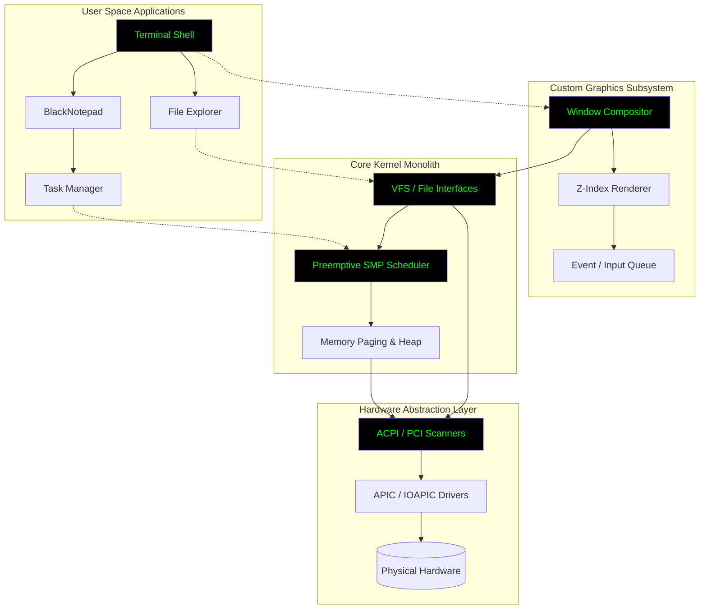

<div align="center">

<!-- Animated Header -->


# BlackOS PHANTOM

<p align="center">
  <strong>Enterprise-Grade, Bare-Metal 32-bit Operating System Built From Scratch</strong>
</p>

<!-- Animated Badges -->
<p align="center">
  <a href="#"></a>
  <a href="#"></a>
  <a href="#"></a>
  <a href="#"></a>
  <a href="#"></a>
</p>

<p align="center">
  <a href="#"></a>
  <a href="#"></a>
  <a href="#"></a>
  <a href="#"></a>
</p>

<!-- Typing Animation SVG -->
<p align="center">
  
</p>

<br/>

<!-- Wave Animation -->


</div>

<br/>

## 🎬 Live Preview Workspace

Experience the true capability of **BlackOS PHANTOM**. Below is raw footage of the system booting, utilizing dynamic Z-index window rendering, file system navigation, and multi-tasking without an underlying host OS.

<div align="center">
  <video src="demo%20video/black%20os.mp4" width="100%" controls autoplay loop style="max-width: 900px; border: 2px solid #333; border-radius: 8px; box-shadow: 0 4px 15px rgba(0,255,0,0.1);"></video>
  <br/>
  <em style="color: #666;">If the player above does not load inline, <a href="demo%20video/black%20os.mp4">click here to download and watch the raw MP4 format</a>.</em>
</div>

<br/>

## 🌐 Overview

<table>
<tr>
<td width="50%">

**BlackOS PHANTOM** is a high-performance, monolithic operating system engineered closely to the metal. Designed to be completely independent, it implements its own standard C library (`libc`), device drivers, security isolation rings, and a custom interactive graphical environment.

Developed under an uncompromising, zero-comment "Black" minimalist aesthetic. Code logic and standard `black_` prefixes handle documentation innately.

**Key Technical Achievements:**
- Symmetric Multiprocessing (SMP)
- Multi-Layered Virtual File Systems (VFS, RamFS, DevFS, ProcFS)
- ACPI, APIC, and IOAPIC Hardware Scanning
- Security Isolations and Ring Implementations

</td>
<td width="50%">

```ascii
  ██████╗ ██╗      █████╗  ██████╗██╗  ██╗ ██████╗ ███████╗
  ██╔══██╗██║     ██╔══██╗██╔════╝██║ ██╔╝██╔═══██╗██╔════╝
  ██████╔╝██║     ███████║██║     █████╔╝ ██║   ██║███████╗
  ██╔══██╗██║     ██╔══██║██║     ██╔═██╗ ██║   ██║╚════██║
  ██████╔╝███████╗██║  ██║╚██████╗██║  ██╗╚██████╔╝███████║
  ╚═════╝ ╚══════╝╚═╝  ╚═╝ ╚═════╝╚═╝  ╚═╝ ╚═════╝ ╚══════╝
```

</td>
</tr>
</table>

<br/>

<div align="center">

</div>

<br/>

## 📖 Table of Contents

- [Core Features](#core-features)
- [Architecture Insights](#architecture-insights)
- [Subsystems & Drivers](#subsystems--drivers)
- [Build Requirements](#build-requirements)
- [Quick Start Configuration](#quick-start-configuration)
- [System Structure](#system-structure)
- [License](#license)

<br/>

## 🚀 Core Features

<div align="center">

| **Kernel Core** | **Memory & Storage** | **Graphics & UI** | **Subsystems** |
|:---:|:---:|:---:|:---:|
| Preemptive Scheduler | PMM & VMM Layer | Drag & Drop Windows | Syscall Dispatcher |
| Hardware Interrupts | Heap (kmalloc) | Resizing & Z-Indexing | e1000 Networking |
| SMP Support | VFS & RamFS | Drop Shadow Renderer | Security Isolations |
| Zero-Comment Code | ProcFS / DevFS | Matrix Environment | IPC Inter-process |

</div>

### Detailed Feature Breakdown

- **Symmetric Multiprocessing (SMP) & Task Management**: A preemptive multi-tasking scheduler built over a Local APIC/IOAPIC backbone. Tasks are efficiently balanced across multiple logical cores with rapid context switching.
- **Custom Graphical Interface Engine**: High-performance, event-driven window manager (`gui/desktop.h`). Features window dragging, dynamic resizing, drop shadows, and true overlapping depth rendering (Z-indexing).
- **Core Memory Management**: Segmented Physical Memory Management (PMM) mapping over the multiboot data, integrated with a robust paging setup (Virtual Memory Manager/VMM) and dynamic heap allocators.
- **Virtual File System (VFS/RAMFS)**: Highly modular file persistence system running entirely in hardware memory. During boot, dynamic directories such as `/System`, `/Users`, and `/Logs` are provisioned autonomously.
- **Built-In Applications**:
    - **BlackNotepad**: A real-time text editor that accepts hardware keystrokes and interfaces with VFS endpoints.
    - **Terminal**: A fully integrated shell environment bridging to the native IPC loops (`ls`, `calc`, `mkdir`, `clear`, etc.).
    - **File Explorer**: Windows-style graphical directory traverser that interacts via `vfs_readdir`.

<br/>

## 🧠 Architecture Insights



<br/>

## ⚙️ Subsystems & Drivers

BlackOS attempts to be fully independent and talks directly to bare-metal hardware. Integrated drivers include:

- **Bus Communication**: PCI Enumeration, ACPI table parsing.
- **Networking**: Early stage support for the Intel `e1000` network interface controller.
- **Input Devices**: Raw PS/2 Keyboard & Mouse interrupts.
- **Audio Output**: Creative Sound Blaster 16 (`sb16`) and generic `wav` stream handling.
- **Graphics Output**: VGA driver interfaces masking standard memory boundaries (`0xB8000`) and advanced high-definition framebuffers.
- **Timekeeping**: PIT (Programmable Interval Timer) alongside RTC (Real Time Clock) polling.

<br/>

## 🛠️ Build Requirements

The OS is configured to be cross-compiled utilizing a standard `i686-elf-` GNU toolchain. It can be built natively on Linux, macOS, or within a Windows `MinGW UCRT64` / `MSYS2` environment.

- `gcc` (13.2.0+ cross-compiled to i686)
- `nasm` (For Assembly assembly targets)
- `make`
- `qemu-system-i386` (for hardware emulation)
- `mtools` & `xorriso` (for Limine ISO generations)

<br/>

## ⚡ Quick Start Configuration

### 1. Compile & Emulate

To compile the monolithic kernel, link the image, and start execution directly inside QEMU with serial output active, run:

```bash
make run
```

*This will automatically launch QEMU with 256M of RAM, 4 SMP cores, and standard VGA capabilities.*

### 2. Physical Hardware ISO Packaging

To simply generate a bootable `.iso` payload via Limine Bootloader (for flashing onto a USB or deploying to an external Hyper-V / VMware instance):

```bash
make iso
```

### 3. Deep Debugging

If you are expanding the `black_` system architecture, use the debug target to spawn GDB over port 1234:

```bash
make debug
```

<br/>

## 📂 System Structure 

```
BlackOS/
├── assets/                   # README graphics
├── boot/                     # x86 Multiboot Assembly Hooks
├── build/                    # Output object files and binaries
├── config/                   # Target linker scripts (linker.ld)
├── demo video/               # Showcase footage and operations
├── include/                  # Global C Header prototypes
├── iso/                      # Final ISO images ready for deployment
├── kernel/                   # Main monolithic code operations
│   ├── arch/                 # Architecture specific configurations (GDT/IDT/x86)
│   ├── drivers/              # Hardware interaction code (VGA, PCI, e1000, ACPI)
│   ├── fs/                   # File system engines (VFS, DEVFS, PROCFS)
│   ├── gui/                  # Desktop logic and window rendering
│   ├── mm/                   # Memory models (PMM, VMM, SLAB allocators)
│   ├── net/                  # Network foundations
│   └── sync/                 # Concurrency implementations (Mutexes, Spinlocks)
├── libc/                     # Standalone C utilities (string, stdlib)
└── usermode/                 # Packaged desktop executables
```

<br/>

## 📜 License

<div align="center">

This bare-metal project is engineered and distributed by the **BlackOS Team**. Fully protected under a standard **MIT open-source license** - see the [LICENSE](LICENSE) file for deep details.

<br/>

---

<br/>

<p align="center">
  
</p>

</div>
